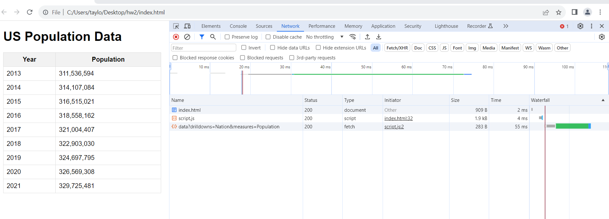

# US Population Data Display

## Description
This project is a web application that displays the US Population data fetched from the DataUSA API. It visualizes the population data in both a tabular format and a graphical line chart to provide a clear and interactive way of understanding the population trends over the years.

## Features
- Fetches the latest US population data from the DataUSA API.
- Displays data in a sortable table.
## Screenshots

